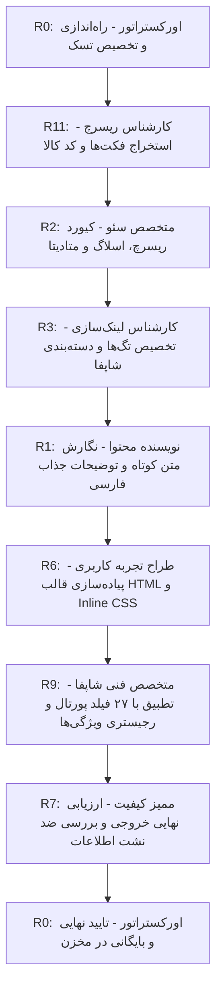

# سند گردش کار نقش‌های ۱۲ گانه سیستم ARIA-G برای تعریف کالا در شاپفا

این سند تبیین‌کننده چرخه متوالی و سیستماتیک تعریف کالای جدید، استخراج فیلدها و استانداردسازی مشخصات فنی در پنل مدیریت شاپفا است.

---

## شرح وظایف گام‌به‌گام و جریان کار (Workflow Steps)

### گام ۱: راه‌اندازی و مدیریت پروژه (R0 - Orchestrator)
*   **مسئول:** R0-Orchestrator
*   **اقدام:** کدهای فنی کالای جدید را دریافت کرده، تسک کارت در `task.md` ایجاد می‌کند و جریان ریسرچ را به نقش R11 محول می‌سازد.

### گام ۲: تحقیقات فنی و پایش بازار (R11 - Research Intelligence)
*   **مسئول:** R11-Research Intelligence
*   **اقدام:** مشخصات عددی واقعی (ابعاد، اوزان خالص به گرم، نوع جوهر، مکانیزم) را از منابع رسمی سازنده و رقبای برتر (دیجی‌کالا و برایتو) استخراج کرده و کدهای فنی کالا (مثل ER-60 یا GS-AP36) را ثبت می‌کند.

### گام ۳: مهندسی سئو و آدرس‌ها (R2 - SEO & SERP Specialist)
*   **مسئول:** R2-SEO Specialist
*   **اقدام:** عنوان صفحه (Meta Title)، کلمات کلیدی هدف (Meta Keywords)، اسلاگ آدرس انگلیسی (Slug URL) و توضیحات کوتاه بهینه‌سازی‌شده (Meta Description) را بر اساس اصول سئو طراحی می‌کند.

### گام ۴: سازماندهی ساختار و ناوبری (R3 - Category & Tag Specialist)
*   **مسئول:** R3-Internal Linking & Tags
*   **اقدام:** دسته اصلی منطبق بر شاپفا و برچسب‌های ناوبری (تگ‌های محصولات) را تخصیص می‌دهد و تگ‌ها را بر اساس مقاله مدیریت برچسب‌ها تنظیم می‌کند.

### گام ۵: کپی‌رایتینگ و نگارش توصیفی (R1 - Content Writer)
*   **مسئول:** R1-Content Production
*   **اقدام:** متون بدنه اصلی و توصیفی محصول را با استفاده از فکت‌های به دست آمده از R11 به زبان فارسی جذاب، ترغیب‌کننده و صمیمی برای کاربر ایرانی نگارش می‌کند.

### گام ۶: طراحی بصری و استایل درون‌خطی (R6 - UX & CRO Designer)
*   **مسئول:** R6-UX/CRO
*   **اقدام:** کدهای HTML بدنه توضیحات تکمیلی را با استفاده از استایل‌های درون‌خطی (Inline CSS) جهت سازگاری کامل با ادوینور WYSIWYG شاپفا طراحی کرده و کادرهای هشدار، مزایا و جدول مشخصات شکیل می‌سازد.

### گام ۷: تطبیق فیلدهای ۲۷ گانه و ویژگی‌ها (R9 - Shopfa Platform Specialist)
*   **مسئول:** R9-Shopfa Verification
*   **اقدام:** داده‌ها را با فیلدهای ۲۷ گانه تعریف محصول شاپفا تطبیق می‌دهد. فیلدهای قیمت و مقدار را جهت پر کردن کاربر تنظیم کرده و نوع کالا و ویژگی‌های آن را با **«کتابچه ویژگی‌های یکتا (Attributes Registry)»** شاپفا همگام‌ساز می‌کند.

### گام ۸: ممیزی کیفیت و حاکمیت داده (R7 - Quality Assurance)
*   **مسئول:** R7-Quality Assurance
*   **اقدام:** کل بسته خروجی (فایل HTML داشبورد و JSON بایگانی) را بر اساس چک‌لیست انطباق ممیزی کرده، قوانین ضد نشت اطلاعات (قانون سلنا، KMT، سی‌کلاس) را کنترل و نمره عبور را صادر می‌کند.

### گام ۹: تأیید نهایی، آرشیو و انتشار (R0 - Release Authority)
*   **مسئول:** R0-Orchestrator
*   **اقدام:** خروجی داشبورد کالا و بایگانی JSON را در شاخه نهایی قرار داده، مستندات واک‌ترو (`walkthrough.md`) را آپدیت کرده و تسک را در پنل به اتمام می‌رساند.
