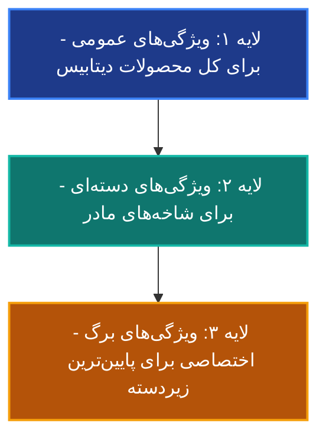
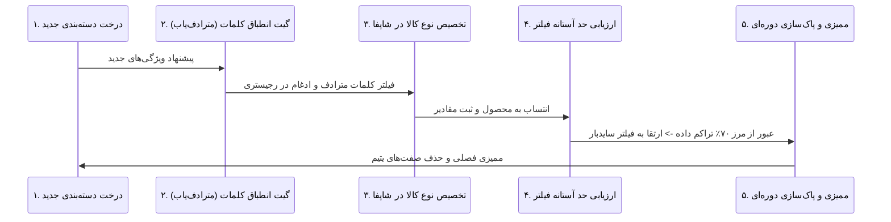

# مرجع استانداردهای فنی سامانه تکامل‌پذیر مدیریت ویژگی‌ها و ناوبری چندوجهی شاپفا (DTAG Engine)

این سند تبیین‌کننده ساختار، استراتژی و قوانین حاکم بر **«سامانه تکامل‌پذیر مدیریت ویژگی‌های هماهنگ»** است. این سیستم به گونه‌ای طراحی شده است که با توسعه دسته‌بندی‌های وب‌سایت و افزایش تنوع کالاها، بدون ایجاد گسیختگی در پایگاه داده یا سردرگمی در فیلترهای تجربه کاربری (UI/UX)، به طور پویا رشد و تکامل یابد.

---

## بخش ۱: معماری اطلاعات و فلسفه تکامل‌پذیری (Evolutionary Architecture)

در فروشگاه‌های بزرگ نوشت‌افزار و لوازم تحریر، با صدها دسته‌بندی مواجه هستیم؛ از ابزارهای نگارش هنری و نقشه‌کشی تا ماشین‌آلات دفتری، ملزومات بایگانی و بازی‌های فکری. یک دیتابیس استاتیک نمی‌تواند پاسخگوی این تنوع باشد. 

**سامانه تکامل‌پذیر ARIA-G (DTAG Engine)** بر اساس مفهوم **«ارث‌بری ژنتیکی ویژگی‌ها» (Attribute Inheritance)** عمل می‌کند. در این مدل، فیلترها و مشخصات در یک هرم سه لایه تعریف می‌شوند:



### هرم سه لایه صفت‌ها:

1.  **لایه ۱: ویژگی‌های عمومی (Global Attributes):**
    صفت‌هایی که برای **تمامی محصولات بدون استثنا** در پنل شاپفا تعریف می‌شوند.
    *   *مثال:* برند کالا، کشور سازنده، وزن خالص پستی (لجستیک)، وضعیت گارانتی/اصالت.
2.  **لایه ۲: ویژگی‌های دسته‌ای (Category-Level Attributes):**
    صفت‌هایی که بین زیرشاخه‌های یک دسته بزرگ مشترک هستند.
    *   *مثال (دسته مادر نوشت‌افزار):* جنس بدنه، ارگونومی گریپ، مکانیزم عملکرد، رده سنی مخاطب.
3.  **لایه ۳: ویژگی‌های برگ (Leaf-Level Attributes):**
    ویژگی‌های فوق‌تخصصی که **فقط** در پایین‌ترین سطح درخت دسته‌بندی فعال می‌شوند.
    *   *مثال (زیردسته خودکار/روان‌نویس):* قطر نوشتاری، نوع جوهر، قابلیت شارژ مجدد یدک.
    *   *مثال (زیردسته چسب ماتیکی):* پایه ترکیبات شیمیایی، مدت زمان خشک شدن، وزن خالص ماده خمیری.

---

## بخش ۲: پروتکل ۵ مرحله‌ای عملیاتی استقرار و تکامل سیستم ویژگی‌ها

برای استقرار و تکامل تدریجی این سیستم با افزودن هر دسته کالایی جدید، تیم مدیریت محتوا و ایجنت‌های سیستم موظف به اجرای پروتکل ۵ مرحله‌ای زیر هستند:



### فاز ۱: آنالیز درخت دسته‌بندی (Category Tree Ingestion)
هنگام ورود یک دسته محصولی جدید به سیستم (مثال: انواع مدادرنگی و ابزارهای نقاشی)، ابتدا درخت دسته‌بندی آن تا عمیق‌ترین سطح ترسیم می‌شود:
$$\text{لوازم هنری} \rightarrow \text{ابزارهای نقاشی و طراحی} \rightarrow \text{مدادرنگی}$$

### فاز ۲: گیت انطباق اصطلاحات و کنترل مترادفات (Synonym Normalization Gateway)
هر ویژگی پیشنهادی برای دسته جدید باید از گیت عبور کند تا بررسی شود که آیا صفت مشابهی در رجیستری مرکزی با نام دیگر وجود دارد یا خیر.
*   **قاعده ادغام:** اگر ویژگی پیشنهادی برای مدادرنگی «سختی مغزی» است، سیستم آن را با ویژگی موجود در مدادهای معمولی مقایسه کرده و در عنوان یکتای **«درجه سختی مغزی»** ادغام می‌کند. از تعریف عناوینی مانند «نوع گرافیت»، «سختی اتود» یا «نرمی مغز» جلوگیری می‌شود.

### فاز ۳: نقشه‌برداری فیلترها و تنوع‌ها (Variant vs. Attribute Mapping)
برای دسته جدید مشخص می‌شود کدام پارامترها جنبه تنوع فروشگاهی (متغیر در قیمت و SKU مانند تعداد رنگ جعبه مدادرنگی: ۱۲ رنگ، ۲۴ رنگ، ۳۶ رنگ) دارند و کدام پارامترها صرفاً صفت‌های فنی مقایسه‌ای هستند (مانند جنس جعبه: فلزی، مقوایی).

### فاز ۴: قانون حد آستانه تراکم فیلتر (Dynamic Facet Thresholding)
برای جلوگیری از شلوغی سایدبار فیلترها در شاپفا، قانون **«حد آستانه تراکم»** اعمال می‌شود:
*   یک ویژگی تازه تعریف‌شده، در ابتدا **فقط** در جدول مشخصات فنی برگه محصول ظاهر می‌شود.
*   تنها زمانی این ویژگی مجوز تبدیل شدن به **فیلتر شونده (Filterable)** در ستون کناری را پیدا می‌کند که حداقل **۷۰ درصد محصولات فعال** آن دسته، آن فیلد را پر کرده باشند. این کار مانع از نمایش فیلترهای کم‌بازده و خالی در سایت می‌شود.

### فاز ۵: حسابرسی دوره‌ای پایگاه داده (Database Audit & Housekeeping)
به صورت فصلی، یک سناریوی ممیزی اجرا می‌شود تا صفت‌های بدون استفاده (Orphan Attributes) که در اثر اتمام موجودی دائمی یا توقف تولید کالاها بی‌استفاده مانده‌اند را شناسایی و ادغام کند تا لود دیتابیس بهینه بماند.

---

## بخش ۳: رجیستری هوشمند توسعه دسته‌بندی‌ها (ویژه توسعه تدریجی)

این بخش به عنوان الگو برای تمام سبک‌های کالایی آینده نوشت‌افزار تدوین شده است تا اپراتورها فیلدها را بر اساس آن تعریف کنند:

### ۱. گروه کالایی: ابزارهای نگارش (روان‌نویس، خودکار، روان‌نویس ژله‌ای)
*   **قطر نوشتاری** (Select Option) -> `[۰.۳، ۰.۴، ۰.۵، ۰.۷، ۱.۰، ۱.۲]` میلی‌متر
*   **نوع جوهر** (Select Option) -> `[ژله‌ای پایه آب، معمولی (نیمه‌ژل)، روغنی روان (ULV)]`
*   **جنس بدنه** (Select Option) -> `[پلاستیک شفاف، پلاستیک سافت‌تاچ، فلزی]`
*   **مکانیزم عملکرد** (Select Option) -> `[درب‌دار، فشاری، چرخشی]`

### ۲. گروه کالایی: مدادها و اتودها (ساده و طراحی ۲ میل به بالا)
*   **نوع مداد** (Select Option) -> `[اتود مکانیکی ساده، اتود طراحی و فنی، مداد مشکی چوبی، مداد روزنامه‌ای]`
*   **قطر مغزی پذیرش** (Select Option) -> `[۰.۳، ۰.۵، ۰.۷، ۰.۹، ۲.۰، ۳.۲، ۵.۶]` میلی‌متر
*   **درجه سختی مغزی** (Select Option) -> `[HB، B، 2B، 4B، H، 2H]`
*   **تراش مغزی در درپوش** (Select Option) -> `[دارد، ندارد]` (ویژه اتودهای طراحی ضخیم)

### ۳. گروه کالایی: مدادرنگی و ابزارهای نقاشی (جدید - در حال توسعه)
*   **تعداد رنگ** (Select Option) -> `[۶، ۱۲، ۲۴، ۳۶، ۷۲، ۱۲۰]` رنگ (تنوع کالا)
*   **جنس بسته‌بندی** (Select Option) -> `[جعبه فلزی، جعبه مقوایی، جعبه فلزی کشویی، استند پلاستیکی]`
*   **فرم بدنه مداد** (Select Option) -> `[گرد، شش‌ضلعی، مثلثی ارگونومیک]`
*   **پایه رنگدانه** (Select Option) -> `[پایه مومی، پایه روغنی، آبرنگی]`

---

# دستورالعمل تحقیقات عمیق: مهندسی معکوس ساختار فیلترهای تکامل‌پذیر رقبا

کارشناس ریسرچ (R11) و متخصص سئو (R2) موظف هستند در تحقیقات بازار و ممیزی ویژگی‌ها، از پرامپت مهندسی‌شده زیر برای پایش تغییرات ساختاری رقبا استفاده کنند:

```text
پرامپت ریسرچ: پایش و تحلیل تجربه کاربری (UI/UX) و ساختار دیتابیس فیلترهای تکامل‌پذیر رقبا
نقش: معمار ارشد پایگاه داده (Database Architect) و متخصص تجربه کاربری فروشگاهی (E-commerce UX Expert)
هدف: کشف فرمول‌بندی و ساختار طبقه‌بندی ویژگی‌های رقبا در دسته‌های نوشت‌افزار در زمان توسعه کاتالوگ و مقیاس بزرگ.

محورهای ریسرچ:
۱. سیستم ارث‌بری ویژگی‌ها (Attribute Inheritance):
   - رقبا در وب‌سایت دیجی‌کالا، برای ابزارهای تخصصی طراحی مانند "مداد طراحی" در مقایسه با "مداد معمولی"، چه ویژگی‌های متمایزی را در فیلترها نمایش می‌دهند؟
   - چگونه فیلترهای عمومی (برند، قیمت) را با فیلترهای فوق‌تخصصی (درجه سختی مغزی، ضخامت مغزی) ترکیب می‌کنند تا از Scroll Fatigue جلوگیری شود؟

۲. مکانیزم نمایش ویژگی‌های بازه‌ای و ابعاد:
   - در دسته‌بندی چسب‌های ماتیکی با اوزان متنوع، رقبا چک‌باکس‌های تکی وزن (مثلاً ۸ گرم) را ترجیح می‌دهند یا بازه‌های گروهی؟
   - برای محصولاتی با تنوع بسیار بالا (مانند رنگ‌های ماژیک نقاشی)، از چه راه‌حل‌های UI/UX برای جلوگیری از شلوغی سایدبار فیلتر استفاده شده است؟

۳. فرمول کوئری‌های پایش ایمن (ضد نشت):
   site:digikala.com/category-mechanical-pencils/ "فیلتر" AND "سختی" AND "قطر" -انتخابات -احزاب
   site:braitore.ir "مشخصات فنی" AND "مدادرنگی" AND "جعبه فلزی"

خروجی نهایی:
یک ساختار مشخصات فنی (Specifications Table) و فیلترهای ناوبری (Navigation Filters) برای دسته‌های جدید واردشده به صنف نوشت‌افزار، به گونه‌ای که با دیتابیس فعلی سی کلاس همخوانی کامل داشته باشد.
```
